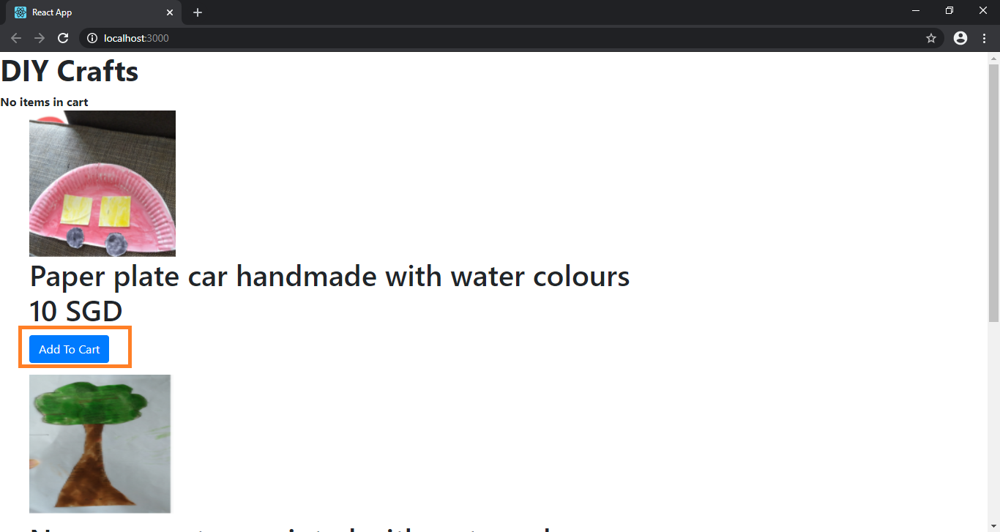
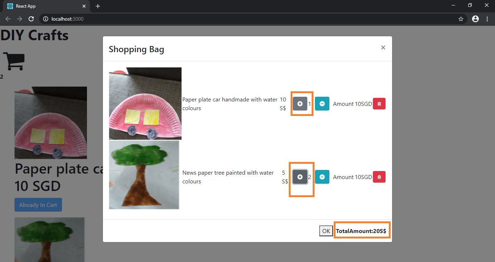

A  Shopping cart built with React, JavaScript, and CSS.

Installation and Setup Instructions.

Clone down this repository. You will need node and npm installed globally on your machine.

Install node modules :

npm install

In the project directory, you can run:

npm start

Runs the app in the development mode.

Open http://localhost:3000 to view it in the browser.

This was a 4 week long project built during my free time at home. I started learning React JS and started trying out a new project for my understanding using visual studio code and tutorial available online.

The technologies implemented in this project are React, JSX, and CSS. I chose to use the create-react-app boilerplate to minimize initial. 

